# Wonder KTV


## Overview

Want to sing songs with friends at home?
Have an audio, a mixer, and mikes, but find it complicated to log songs?
Wonder KTV is here to help!

Wonder KTV is a web app that allow users to search and play song videos.
One can enter as a guest to get into the guest room, or register and log in as a registered user.
Registered users can create their own rooms or enter other rooms.
Inside the room, users can add songs, change the board and see others in the room.
Registered users can also access their history of songs they had added.
(Currently, the song videos are loaded from Youtube)


## Data Model

The application will store TheHall, Rooms, Users, Playlists, Songs, Histories, and Records.

* The hall has multiple rooms
* Each room has a playlist, a board, and multiple users
* Each playlist can have multiple songs
* Each user has a history
* Each history can have multiple records

Sample Documents:

An Example Hall with Embedded Rooms:

```javascript
[
  {
    name: "Guest Room",
    playlist: [songId1, songId2, ...],
    members: [guestId1, ...],
    board: "Happy Birthday To HappyDog!"
  },
  {
    name: "happyDog's room",
    playlist: [songId1, songId2, ...],
    members: [memberId1, ...],
    board: "Happy Birthday!"
  },
  // ...other rooms
]
```

An Example Song:

```javascript
{
  id: //...generated by db,
  name: "Two Tiger (original)",
  path: // youtubeVideoId,
  accompanient: true,  // original or with accompaniment
  duration: "3min12s",
  description: // youtube video name: youtube video description
}
```


An Example User:

```javascript
{
  registered: true,   // if false, then identified as a guest
  username: "happyDog",
  password: // a hashed password,
  history: // id to the history document in histories collection
  room: //room id the user is currently in, null if not in any room
}
```

An Example History with Embedded Record:

```javascript
{
  id: //...generated by db,
  user: //...userId,
  records: [
    {
      timeAdded: //...time,
      song: //...songId
    }
  ]
}
```


## [Link to Commented First Draft Schema](db.mjs) 


## Wireframes

/ - page for first visit
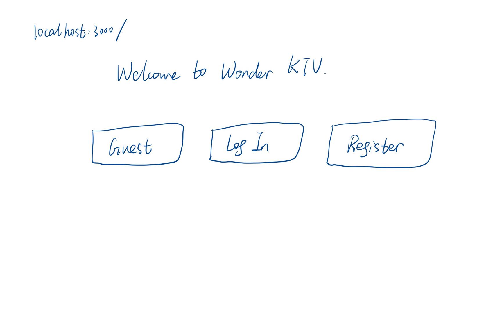

/home - page after entered, also user's homepage
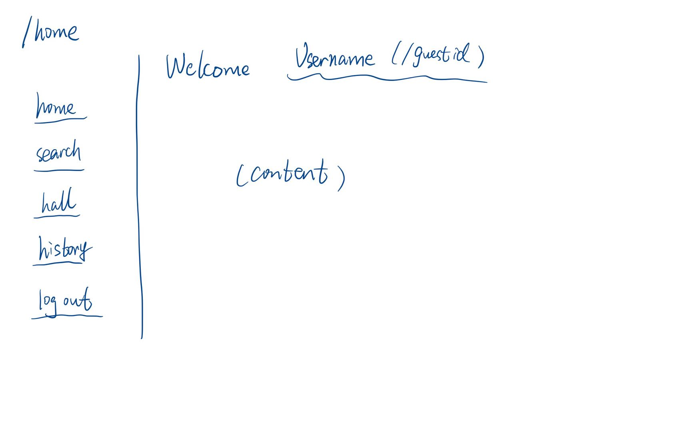

/login - page for log in 
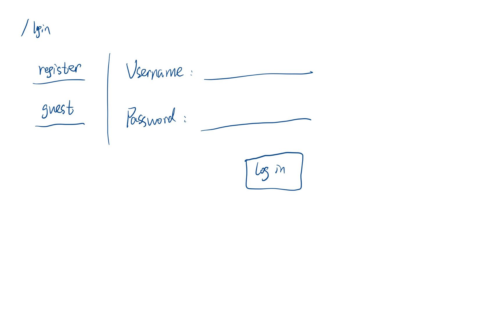

/register - page for register
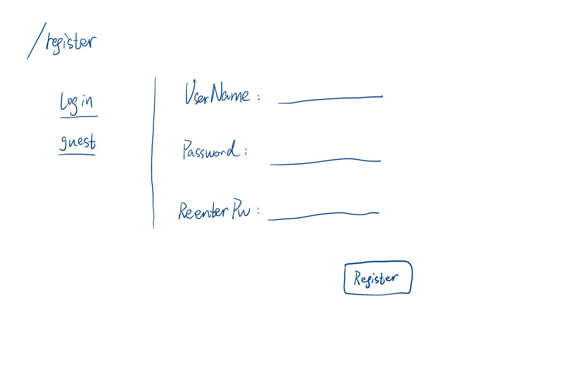

/room - page as the hall to display all available rooms
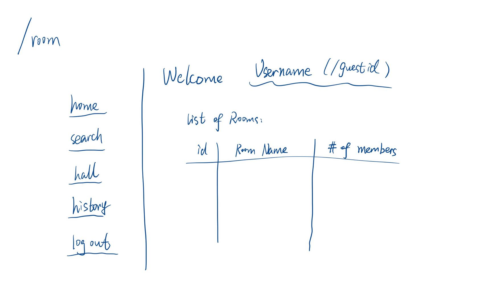

/room/create - page for create a room
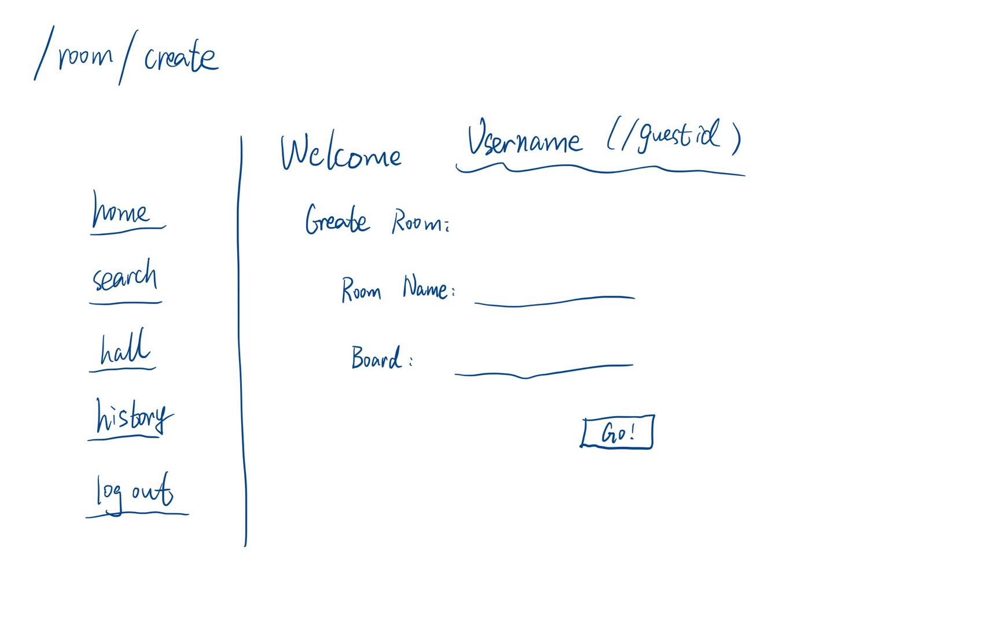

/room/:id - page for the specific room entered
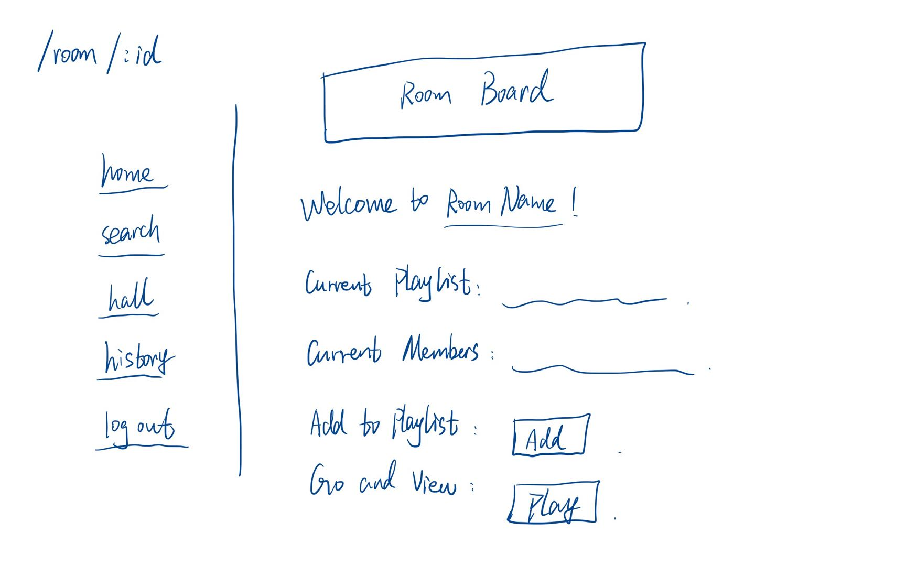

/room/:id/add - page for add song to playlist of the specific room
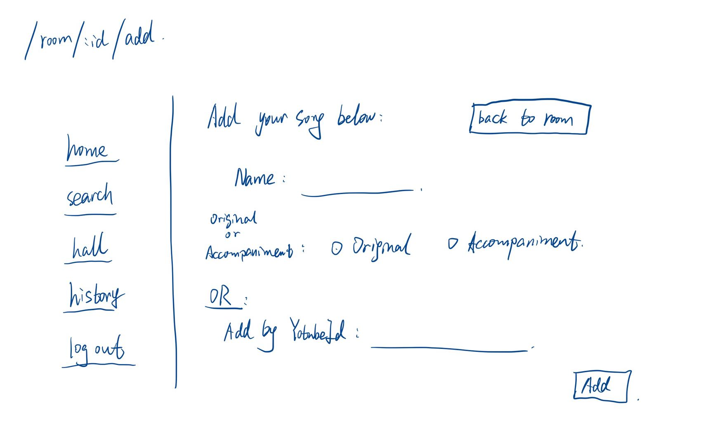

/room/:id/play - page that playing the current song for the specific room
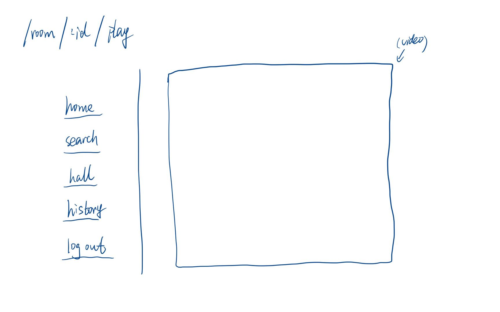

/search - page for users to search the video they want before they add to the room playlist
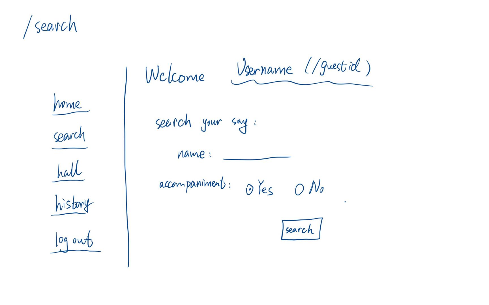

/search/result - page displaying the results of the search
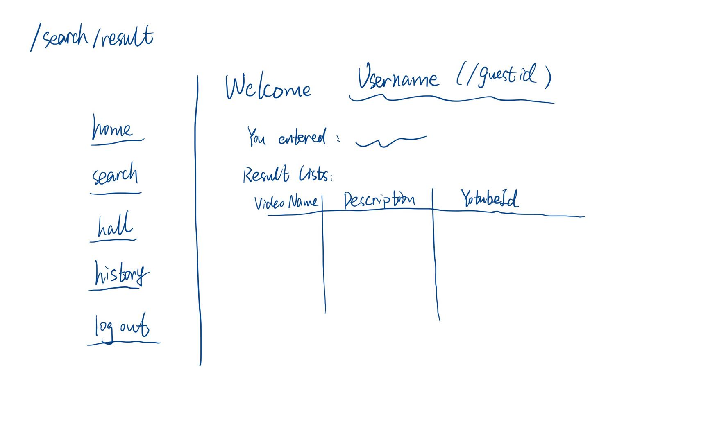

/user/history - page displaying the records of user history
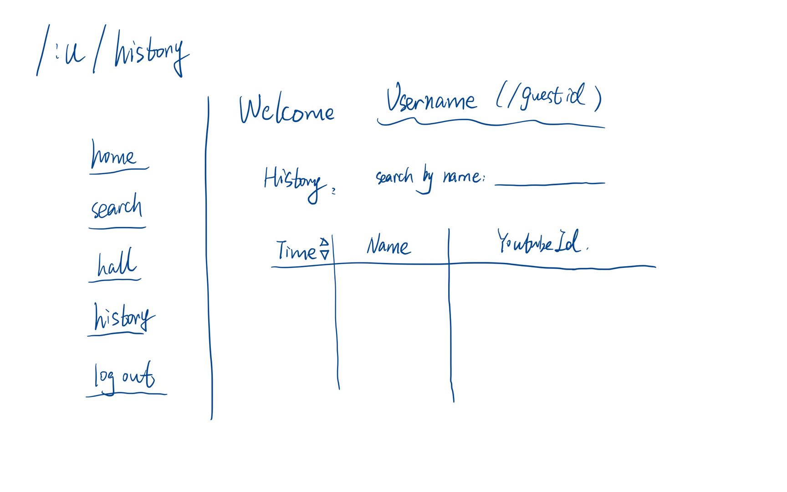


## Site map
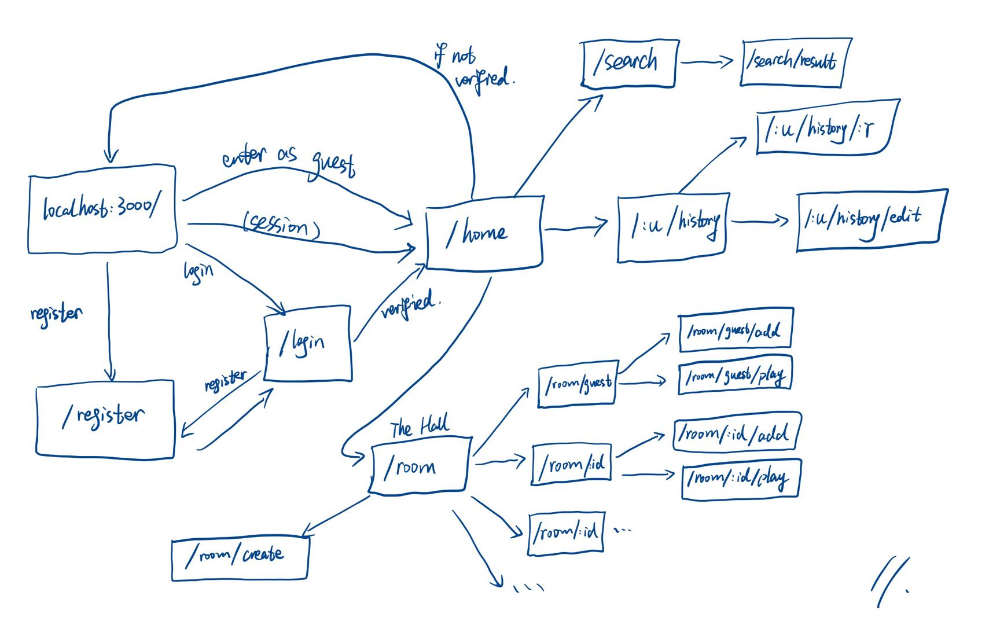


## User Stories or Use Cases
1. Users can choose to enter as a guest, or register and login.
2. Guest users will enter the same guest room.
3. Registered users can create their own rooms or enter other rooms from the hall.
4. Inside a room, user can search and add songs to the playlist of the room.
5. Inside a room, user can view other members in that room.
6. Inside a room, user can see the playlist and control the order of the playlist.
7. Inside a room, user can send messages to the chatbox of the room.
8. Registered users can view the history records of the songs they have added and delete some records.
9. Registered users can search song videos outside rooms


## Research Topics

* (2 points) Integrate YoutubeAPI
    * use YoutubeApi for video search and video playing
    * understand what are they, how they work, and how to use them
    * design my app carefully to reduce api calls by find some way to save the data internally
    * explored PlaylistItems, IFrame APIs
* (6 points) Explore React.js and Next.js
    * explore react.js and Next.js functionalities
    * this requiring self learning React.js, Next.js using App router, Typescript
    * understanding serverless functions
    * different kinds of hooks, like useEffect(), useRef(), useForm(), useState()
    * worthing 6 points
* (2 points) Deployment with Vercel and Heroku
  * explored the deployment procedure
  * get a domain of my own, ktv.wonder947.com, and deployed the major body of my app to it with vercel
  * to integrate with Web Socket, I create a separate server for hosting web socket server, which is deployed to Heroku
* (1 points) Explored other libraries
  * explored zustand


## [Link to Initial Main Project File](app.mjs) 


## Annotations / References Used

1. [tutorial on React.js](https://react.dev/learn)
2. [form tutorial on Next.js App router](https://nextjs.org/docs/app/building-your-application/data-fetching/forms-and-mutations)
3. [tutorial on Next.js + App router + Mongodb + User Rego and login with example](https://jasonwatmore.com/next-js-13-app-router-mongodb-user-rego-and-login-tutorial-with-example)
4. [npm react-youtube](https://www.npmjs.com/package/react-youtube)

